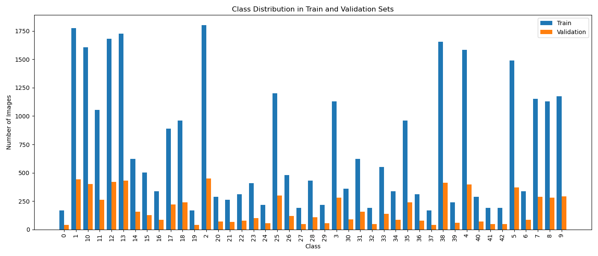
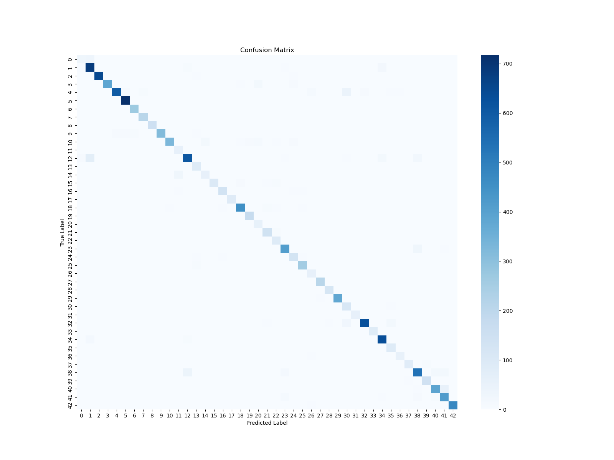
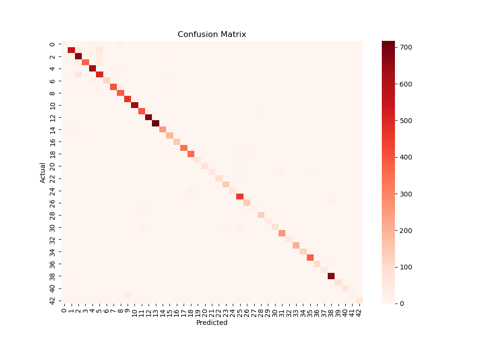
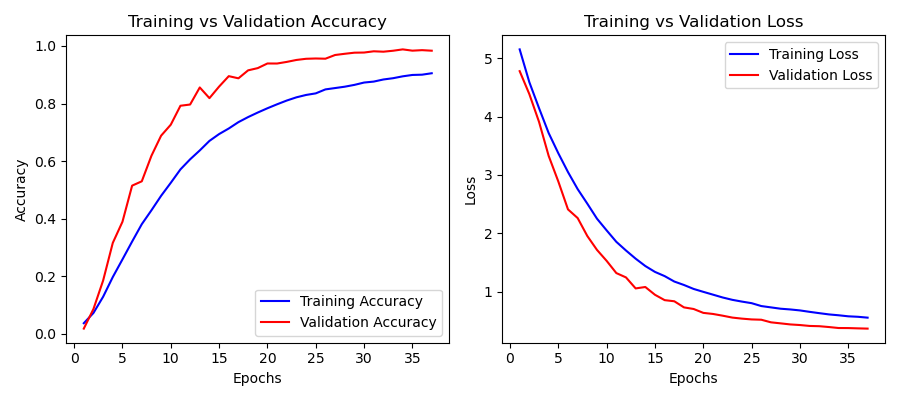

# Traffic Sign Recognition System

## Overview
This project builds and compares two models for recognizing traffic signs from the [GTSRB dataset](http://benchmark.ini.rub.de/?section=gtsrb&subsection=news):

- A **Convolutional Neural Network (CNN)** using TensorFlow/Keras.
- A **Random Forest Classifier** using scikit-learn.


## Project Structure
```
TRAFFIC_SIGN_DECODER/
│
├── assets/
│   ├── Images/                       # Raw or test images
│   ├── cnn_model.keras               # Saved CNN model
│   ├── mapping.json                  # Custom class ID to name mapping
│   ├── Meta.csv                      # Metadata
│   ├── Test.csv                      # Test dataset metadata
│   ├── Train.csv                     # Training dataset metadata
│   ├── traffic_sign_rf_model.pkl     # Saved Random Forest model
│   ├── X_train.pkl / y_train.pkl     # RF training data
│   ├── X_test.pkl / y_test.pkl       # RF test data
│
├── dataset/                          # Full dataset (organized image folders)
│
├── source/
│   ├── CNN/
│   │   ├── data.py                  # Load & prepare data
│   │   ├── prediction.py            # Predict using CNN
│   │   ├── preprocess.py            # Preprocessing utilities
│   │   ├── test.py                  # Evaluate CNN model
│   │   └── train.py                 # Train CNN model
│   │
│   ├── RandomForest/
│   │   ├── data.py                  # Load & process data
│   │   ├── prediction.py            # Predict using Random Forest
│   │   ├── preprocessing.py         # Feature extraction (histograms, etc.)
│   │   ├── test.py                  # Evaluate RF model
│   │   └── train.py                 # Train RF model
│
├── trash/                            # Temporary or discarded files
│
├── .gitignore                        # Git ignore rules
├── README.md                         # Project documentation
├── requirements.txt                  # Project Requirements

```


## 📊 Data

The dataset used in this project is based on the **German Traffic Sign Recognition Benchmark (GTSRB)**. It contains thousands of labeled images of traffic signs from 43 distinct classes.

### 🔢 Dataset Details

- **Total Classes**: 43  
- **Image Size**: Resized to **64x64**


### 🧾 Data Distribution

The graphs below illustrate the distribution of traffic sign classes in the dataset:



#### 📈 Test Set Distribution


> These charts help identify class imbalance, and guide decisions for augmentation or weighting.


## Models

### CNN Model
The implemented CNN architecture consists of:
- Convolutional layers with ReLU activation
- MaxPooling layers for downsampling
- Dropout layers to prevent overfitting
- Fully connected layers for classification

### Random Forest Model
The Random Forest implementation uses:
- Ensemble of decision trees
- Feature importance analysis
- Hyperparameter optimization

## Confusion Matrices

### CNN Model Confusion Matrix
The confusion matrix for the CNN model shows the model's classification performance across all classes. The diagonal elements represent the number of correctly classified points, while off-diagonal elements represent misclassifications.




### Random Forest Confusion Matrix
The confusion matrix for the Random Forest model:




Interpretation:
- The Random Forest model correctly classified 238 samples of Class 0, 221 samples of Class 1, and 261 samples of Class 2
- Similar misclassification patterns to the CNN, but with slightly different distribution

## Training Data Performance

### CNN Training Metrics




## 🧠 Models Overview

| Model             | Accuracy  | Framework     | Feature Extraction     |
|------------------|-----------|---------------|------------------------|
| CNN              | ~94.76%    | TensorFlow    | End-to-end             |
| Random Forest    | ~89.68%    | Scikit-learn  | HOG (Histogram of Oriented Gradients) |

---
## Usage

### Prerequisites
- Python 3.8+
- PyTorch 1.10+
- scikit-learn 1.0+
- pandas, numpy, matplotlib

### Installation
```bash
# Clone the repository
git clone https://github.com/being-bilal/Traffic-Sign-Decoder.git
cd Traffic-Sign-Decoder

# Install dependencies
pip install -r requirements.txt
```
